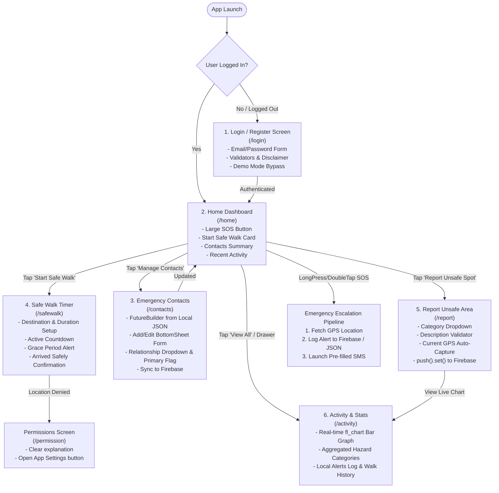
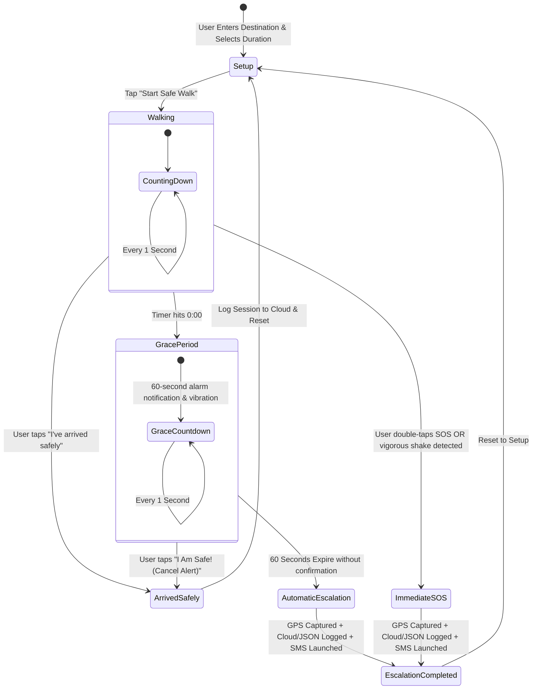

# SafeWalk - Screen Flow & State Machine

## 1. Complete Application Screen Navigation Flow

```mermaid
flowchart TD
    Start([App Launch]) --> AuthGate{User Logged In?}
    
    AuthGate -->|No / Logged Out| LoginScreen["1. Login / Register Screen\n(/login)\n- Email/Password Form\n- Validators & Disclaimer\n- Demo Mode Bypass"]
    AuthGate -->|Yes| HomeScreen["2. Home Dashboard\n(/home)\n- Large SOS Button\n- Start Safe Walk Card\n- Contacts Summary\n- Recent Activity"]
    
    LoginScreen -->|Authenticated| HomeScreen

    HomeScreen -->|Tap 'Start Safe Walk'| SafeWalkScreen["4. Safe Walk Timer\n(/safewalk)\n- Destination & Duration Setup\n- Active Countdown\n- Grace Period Alert\n- Arrived Safely Confirmation"]
    
    HomeScreen -->|Tap 'Manage Contacts'| ContactsScreen["3. Emergency Contacts\n(/contacts)\n- FutureBuilder from Local JSON\n- Add/Edit BottomSheet Form\n- Relationship Dropdown & Primary Flag\n- Sync to Firebase"]
    
    HomeScreen -->|Tap 'Report Unsafe Spot'| ReportScreen["5. Report Unsafe Area\n(/report)\n- Category Dropdown\n- Description Validator\n- Current GPS Auto-Capture\n- push().set() to Firebase"]
    
    HomeScreen -->|Tap 'View All' / Drawer| StatsScreen["6. Activity & Stats\n(/activity)\n- Real-time fl_chart Bar Graph\n- Aggregated Hazard Categories\n- Local Alerts Log & Walk History"]
    
    HomeScreen -->|LongPress/DoubleTap SOS| EscalationFlow["Emergency Escalation Pipeline\n1. Fetch GPS Location\n2. Log Alert to Firebase / JSON\n3. Launch Pre-filled SMS"]
    
    SafeWalkScreen -->|Location Denied| PermScreen["Permissions Screen\n(/permission)\n- Clear explanation\n- Open App Settings button"]
    
    ReportScreen -->|View Live Chart| StatsScreen
    ContactsScreen -->|Updated| HomeScreen
```

---

## 2. Safe-Walk Timer State Machine

```mermaid
stateDiagram-v2
    [*] --> Setup: User Enters Destination & Selects Duration
    Setup --> Walking: Tap "Start Safe Walk"
    
    state Walking {
        [*] --> CountingDown
        CountingDown --> CountingDown: Every 1 Second
    }
    
    Walking --> ArrivedSafely: User taps "I've arrived safely"
    Walking --> ImmediateSOS: User double-taps SOS OR vigorous shake detected
    
    Walking --> GracePeriod: Timer hits 0:00
    
    state GracePeriod {
        [*] --> GraceCountdown: 60-second alarm notification & vibration
        GraceCountdown --> GraceCountdown: Every 1 Second
    }
    
    GracePeriod --> ArrivedSafely: User taps "I Am Safe! (Cancel Alert)"
    GracePeriod --> AutomaticEscalation: 60 Seconds Expire without confirmation
    
    AutomaticEscalation --> EscalationCompleted: GPS Captured + Cloud/JSON Logged + SMS Launched
    ImmediateSOS --> EscalationCompleted: GPS Captured + Cloud/JSON Logged + SMS Launched
    
    ArrivedSafely --> Setup: Log Session to Cloud & Reset
    EscalationCompleted --> Setup: Reset to Setup
```
